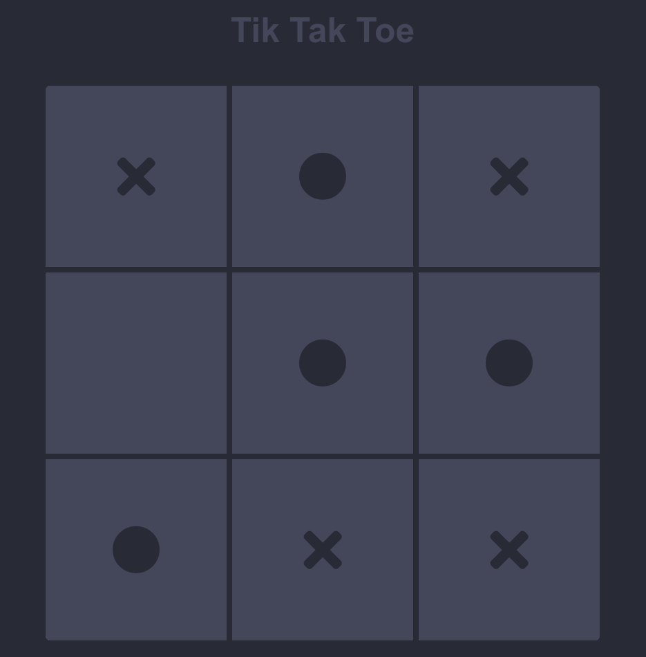

<h1 class="title">TikTakToe</h1>

 A game for two players who take turns marking the spaces in a three-by-three grid with X or O.

   

  
 
 

<h3>https://lee3007.github.io/tik-tak-toe-web/</h3>

   

# Language Table

    <a class="text" href="#English">English</a>  
    <a class="text" href="#Português">Português</a>

   

# English

This project was made in order to practice and test my <b>HTML, CSS and JS</b> skills, meaning it does not use any external libraries or frameworks (pure JavaScript). I got the inspiration to develop this game from my memories as a kid playing Tik-Tak-Toe with my friends during the boring history class.    I strongly believe that the process of developing this game improved my programming skills and would recommend any dev to try it yourself.
      

The game was made in order to be played by two players. So get a friend and <a src="https://lee3007.github.io/js-snake/">start playing it!</a>
     

If you have any questions about the code, or want to give feedback, please reach me on my email:

felipe.lee30@gmail.com   

<h3>How to reach me</h3>

  
   
<!--    -->
  
  
   

      

# Português

Este projeto foi feito com o objetivo de praticar e testar minhas habilidades em <b>HTML, CSS e JS</b>, o que siginifica que não foi utilizado nenhuma biblioteca externa ou framework (JavaScript puro). Tive a inspiração para desenvolver esse jogo das minhas memórias de criança jogando Jogo da Velha com meus amigos durante a entediante aula de história.    Eu acredito fortemente que o processo de desenvolvimento deste jogo melhorou minhas habilidades de programação e recomendaria para qualquer desenvolvedor tentar você mesmo.
      

O jogo foi feito para ser jogado por dois jogadores. Então convide um amigo e <a src="https://lee3007.github.io/js-snake/">comece a jogar!</a>
     

Se você tem alguma pergunta sobre o código, ou quer redigir comentários, favor me contatar em meu email:

felipe.lee30@gmail.com   

<h3>Contato</h3>

  
   
<!--    -->
  
  
   

      
